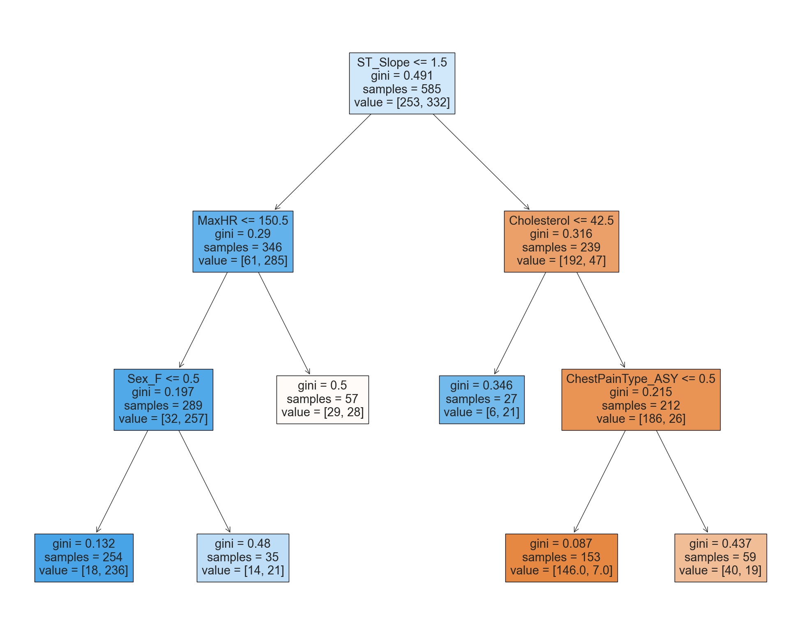

# Лабораторная работа 5
## Вариант 17
*Набор данных:* В датасете *default.csv* моего варианта (17), все порядковые признаки уже оказались перекодированы и не было номинальных, поэтому я взял другой популярный классический датасет, в котором присутствовали неперекодированные категориальные признаки: [Heart Failure Prediction Dataset](https://www.kaggle.com/datasets/fedesoriano/heart-failure-prediction)
*Независимые переменные:*
Age, Sex, ChestPainType, RestingBP, Cholesterol, FastingBS,
RestingECG, MaxHR, ExerciseAngina, Oldpeak, ST_Slope,
HeartDisease
*Зависимая переменная:* HeartDisease
*Метод ансамблирования:* Random Forest

1. Данные были разделены на двe выборки: обучающую 85% и тестовую 15%. Предварительный анализ обнаружил примерно равные доли классов.

2. Найденный с помощью кросс-валидации оптимизированный параметр $alpha$ для дерева с обрезкой ветвей оказался равен 0.002. В оптимальном поддереве количество узлов составило 49, поэтому графическое представление было построено для субоптимального поддерева меньшего размера с 11 узлами .

3. Поиск по сетке 7x7 для случайного леса дал оптимальное кол-во деревьев $B=40$ и количество предикторов на одном сплите $m=4$.

4. Наиболее точной оказалась модель дерева случайного леса, её $Accuracy$ на трейне составила 87%.

5. $Accuracy$ предсказания модели случайного леса на отложенных наблюдениях составила 86%, остальные метрики приведены в таблице

              precision    recall  f1-score

           0       0.81      0.86      0.83
           1       0.89      0.85      0.87 